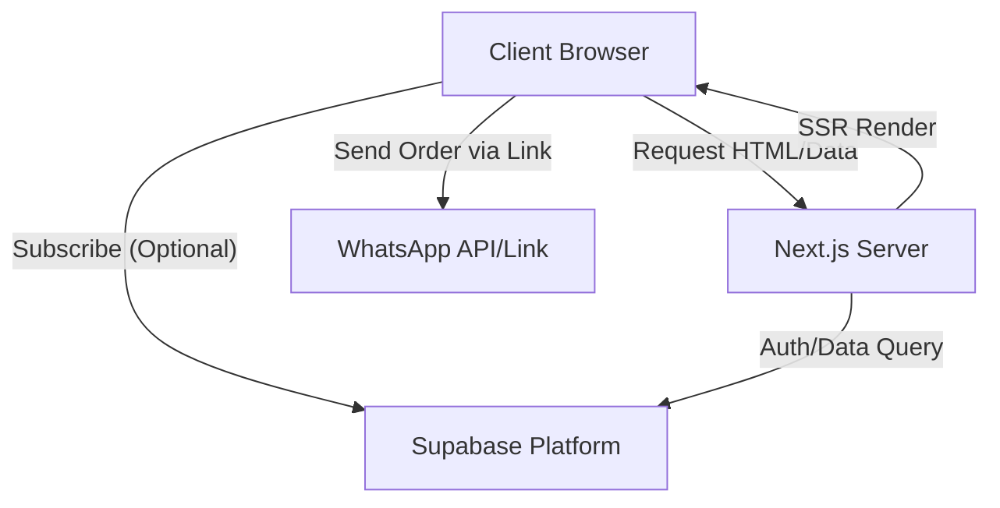

# Deliverables

## 1. Application Architecture

### Frontend (Next.js App Router)
- **Framework**: Next.js 14+ (latest) with App Router for server-side rendering and routing.
- **Styling**: TailwindCSS for utility-first styling.
- **UI Component Library**: HeroUI (formerly NextUI) for accessible, beautiful components.
- **State Management**: Zustand for global client state (Cart, User Preferences).
- **Authentication**: NextAuth.js (v5) configured with Supabase Adapter.

### Backend (Supabase)
- **Database**: PostgreSQL (managed by Supabase).
- **Auth**: Supabase Auth (or NextAuth wrapping it).
- **Storage**: Supabase Storage for menu images and restaurant logos.
- **Realtime**: (Optional) For dashboard order updates.

### Diagram Reference


## 2. Database Schema (Supabase)

See `schema.sql` for the complete SQL. Brief overview:

- **Users**: Admin, Restaurant Owners, Customers.
- **Restaurants**: Profile, QR Code, WhatsApp Config.
- **Categories**: Menu sections (Starters, Mains).
- **Items**: Menu items with prices, descriptions, images.
- **Orders**: Tracks order status and content.
- **OrderItems**: Link between Orders and Items.

## 3. authentication & Role Management

- **Role-Based Access Control (RBAC)**:
  - **Admin/Owner**: Full access to dashboard.
  - **Customer**: View menus, place orders, history (if logged in).
- **Strategy**:
  - `public.users` table extends auth.users.
  - Row Level Security (RLS) policies to enforce data isolation (e.g., Owners can only edit their own restaurants).

## 4. Menu Digitization Data Model

- **Menu**: A container for Categories.
- **Category**: Has `name`, `sort_order`, `is_active`.
- **Item**: Has `name`, `description`, `price`, `image_url`, `dietary_tags` (veg, spicy), `is_available`.
- **Workflow**:
  1.  Admin uploads image (stored in Supabase Storage).
  2.  (Future) OCR service parses text.
  3.  Admin verifies and saves structured data to `items` table.

## 5. QR Code Generation Workflow

1.  **Trigger**: When a restaurant is created or updated.
2.  **Process**:
    - Generate a unique URL: `https://app.com/menu/[restaurant_slug]`
    - Use a QR library (e.g. `qrcode` or `next-qrcode`) to render this URL as an image SVG/PNG.
    - Store/Display QR code in Admin Dashboard for printing.
    - Printing support: CSS print media query to format for thermal printers (58mm/80mm).

## 6. WhatsApp Order Integration Flow

1.  **Cart Assembly**: Customer adds items to Zustand store `useCartStore`.
2.  **Checkout**:
    - User clicks "Send Order".
    - App formats message string:
      ```text
      *New Order #123*
      ----------------
      2x Burger ($20)
      1x Coke ($2)
      ----------------
      Total: $22
      
      Customer: John Doe
      Table: 5 (if applicable)
      ```
    - App constructs URL: `https://wa.me/[RestaurantWhatsApp]?text=[EncodedMessage]`.
    - Redirects user to WhatsApp.

## 7. Wallet Card Integration Strategy

- **Provider**: Use a service like `passkit-generator` or similar libraries if generating locally, or a SaaS (PassKit) for easier management.
- **Flow**:
  - User clicks "Add to Wallet".
  - Server generates `.pkpass` file (Apple) or Google Pay Object.
  - Returns file stream to client.
  - Client prompts native wallet add dialog.

## 8. UI/UX Structure (Mobile-First)

- **Touch Friendly**: Large buttons (44px+ height).
- **Navigation**: Bottom tab bar for Customers (Menu, Cart, Orders, Profile).
- **Visuals**:
  - Large customized Hero images for food.
  - Skeleton loaders for perceived performance.
  - Glassmorphism headers.
- **Performance**:
  - Image optimization (Next/Image).
  - Lazy loading of categories.

## 9. Folder Structure

```
/app
  /(auth)         # Login/Signup routes
  /(dashboard)    # Protected Admin/Owner routes
  /menu/[slug]    # Public Customer Menu
  /api            # API Routes
/components
  /ui             # HeroUI + Custom UI components
  /menu           # Menu specific components
  /cart           # Cart drawer/modal
/lib
  supabase.ts     # Supabase client
  utils.ts        # Helper functions
/store
  useCartStore.ts # Zustand store
  useAuthStore.ts # (Optional) Client auth state
```

## 10. Example API Routes & Stores

See `store/useCartStore.ts` and `app/api/` (to be created).
